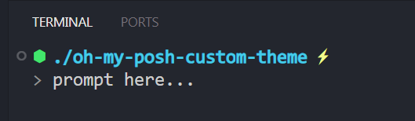

# Dot and Bolt: Oh My Posh Theme

A clean, two-line, and minimalist theme for [Oh My Posh](https://ohmyposh.dev/). It focuses on providing essential information, the current directory and Git status without cluttering the terminal.

## Preview


## Requirements

1.  **Oh My Posh:** You must have Oh My Posh installed and configured for your shell.
2.  **Nerd Font:** A [Nerd Font](https://www.nerdfonts.com/) must be installed and set as the font for your terminal to render the icons correctly.

## Installation

1.  **Save the theme:**
Save the JSON code provided into a file. A good name would be `dot-and-bolt.omp.json`. Place this file in your Oh My Posh themes folder (you can find the location by running `echo $POSH_THEMES_PATH` in your terminal).

2.  **Update your shell profile:**
Modify your shell's configuration file (e.g., `$PROFILE` for PowerShell, `.zshrc` for Zsh, or `.bashrc` for Bash) to use this new theme.

    **Example for PowerShell:**

    ```powershell
    oh-my-posh init pwsh --config 'C:\path-to-your-themes\dot-and-bolt.omp.json' | Invoke-Expression
    ```

    _Replace `C:\path\to\your\themes\` with the actual path to where you saved the file._

3.  **Reload your shell:**
Restart your terminal or reload your profile (e.g., by running `. $PROFILE` in PowerShell) for the changes to take effect.

## Customization

You can easily customize this theme by editing the `dot-and-bolt.omp.json` file.

- **Change colors:** Modify the `foreground` hex color codes (e.g., `#43CCEA`) to match your preferred color scheme.
- **Change icons:** Replace the Unicode characters in the `template` fields (e.g., `\u2B22` for the diamond `⬢` or `\u26A1` for the lightning bolt `⚡`) with any other icon from your Nerd Font.
- **Show Git Branch:** To display the current Git branch name, modify the `git` segment's template:
  ```json
  "template": "<#F1FA8C>\u26A1</> <b>{{ .Head }}</b>"
  ```
